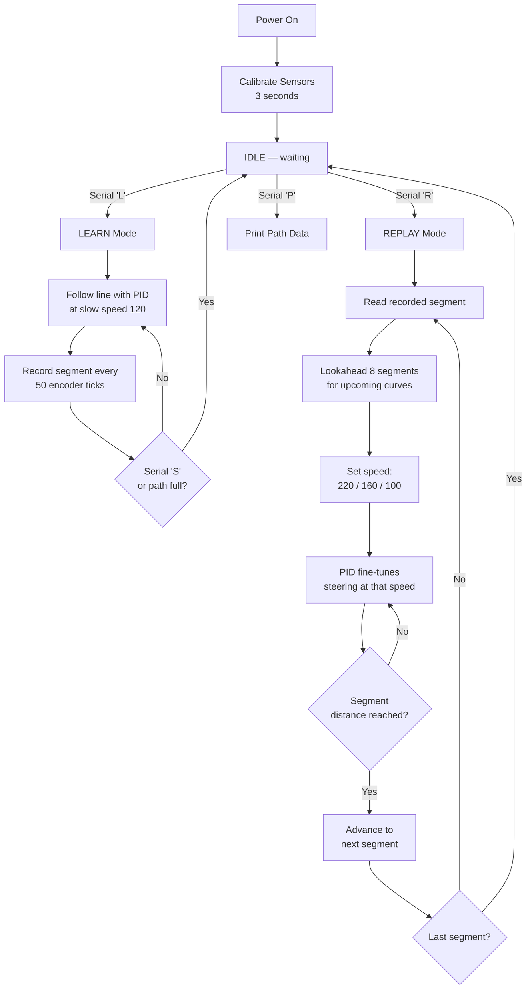

# LFR_PathLearn.ino — Full Code Walkthrough

A section-by-section breakdown of what every part of the code does and **why**.

---

## 1. Pin Definitions (Lines 48–73)

```cpp
#define S0    2
#define S1    3
// ... etc
#define ENC_LA  22
#define ENC_LB  23
#define ENC_RA  20
#define ENC_RB  21
```

Just names for your physical wires. Grouped into 4 blocks:

| Block | Pins | Purpose |
|---|---|---|
| **Mux sensor** | S0–S3, EN, Z_OP | Controls which of the 16 sensors to read, and reads its value |
| **Left motor** | AIN1, AIN2, PWMA | Direction + speed for left wheel |
| **Right motor** | BIN1, BIN2, PWMB | Direction + speed for right wheel |
| **Encoders** | ENC_LA/LB, ENC_RA/RB | Two channels per motor — tells us how much each wheel has turned |

---

## 2. Tuning Parameters (Lines 75–97)

There are **two separate sets of PID gains** — this is key:

```cpp
// LEARN mode — conservative, safe
float Kp_learn = 5.0;   // Strong correction
float Kd_learn = 2.5;   // Decent damping
int   learnSpeed = 120;  // Slow and steady

// REPLAY mode — lighter touch, speed handled by path profile
float Kp_replay = 3.5;  // Softer (path profile does the heavy lifting)
float Kd_replay = 2.0;
int   replayFast   = 220;  // Straights
int   replayMedium = 160;  // Gentle curves
int   replaySlow   = 100;  // Sharp curves
```

**Why two sets?** During LEARN, PID is the *only* thing steering the robot — it needs to be aggressive. During REPLAY, the recorded path profile handles speed management, so PID just does fine corrections — it can be softer, which means less oscillation at high speed.

---

## 3. Path Recording Data Structure (Lines 105–118)

```cpp
struct PathSegment {
  int16_t  leftTicks;   // How far left wheel turned
  int16_t  rightTicks;  // How far right wheel turned
  int16_t  avgError;    // Average steering error (= curvature)
};

PathSegment path[4000];  // The recorded "map"
int pathLength = 0;       // How many segments we've recorded so far
```

Think of this as chopping the track into small pieces. Each piece records:
- **leftTicks / rightTicks** — if they're equal, the robot went straight. If left > right, it curved right (and vice versa)
- **avgError** — how far off-center the line was on average. Big number = sharp turn. Small number = straight

> [!TIP]
> With `SEGMENT_TICKS = 50`, each segment covers about 50 encoder ticks of travel (~1–2 cm depending on your encoder resolution). The 4000-segment buffer can record tracks up to ~40–80 meters long.

---

## 4. Encoder Interrupts (Lines 121–130)

```cpp
volatile long encLeftCount  = 0;
volatile long encRightCount = 0;

void encLeftISR() {
  if (digitalReadFast(ENC_LB)) encLeftCount++;
  else                          encLeftCount--;
}
```

This runs **automatically every time the encoder wheel clicks one notch**, even while the rest of your code is doing other things. That's what `attachInterrupt` does — it's hardware-level, not polled.

**How direction detection works:**
- Interrupt fires on channel A's rising edge
- At that exact moment, we check channel B
- If B is HIGH → wheel is spinning forward → count up
- If B is LOW → wheel is spinning backward → count down

```
Forward rotation:        Backward rotation:
A: _/‾\_/‾\_/‾\         A: _/‾\_/‾\_/‾\
B: __/‾\_/‾\_/‾         B: /‾\_/‾\_/‾\_
     ↑ B is HIGH              ↑ B is LOW
```

> [!NOTE]
> `volatile` tells the compiler "this variable can change at any time from an interrupt — don't optimize it away or cache it."

---

## 5. Motor Helpers (Lines 142–163)

```cpp
void motorLeft(int spd) {
  if (spd >= 0) {
    digitalWrite(AIN1, LOW);
    digitalWrite(AIN2, HIGH);
    analogWrite(PWMA, constrain(spd, 0, maxSpeed));
  } else {
    digitalWrite(AIN1, HIGH);
    digitalWrite(AIN2, LOW);
    analogWrite(PWMA, constrain(-spd, 0, maxSpeed));
  }
}
```

Standard H-bridge motor control:
- **Positive speed** → AIN1=LOW, AIN2=HIGH → motor spins forward
- **Negative speed** → AIN1=HIGH, AIN2=LOW → motor spins backward
- **PWM value** controls how fast (0=stop, 255=full speed)

---

## 6. Sensor Reading & Calibration (Lines 166–214)

### `readMux(channel)` — Read one sensor
```cpp
digitalWrite(S0, channel & 1);         // Set bit 0
digitalWrite(S1, (channel >> 1) & 1);  // Set bit 1
digitalWrite(S2, (channel >> 2) & 1);  // Set bit 2
digitalWrite(S3, (channel >> 3) & 1);  // Set bit 3
delayMicroseconds(15);                 // Wait for mux to switch
return analogRead(Z_OP);               // Read the voltage
```

The 16 sensors share a single analog pin through a multiplexer. S0–S3 form a 4-bit address (0–15) to select which sensor's value appears on Z_OP. 

### `calibrate()` — Auto-learns white vs black

Runs for 3 seconds on startup. You sweep the robot over the line, and it records the **minimum** (white surface) and **maximum** (black line) ADC value for each sensor. Later, `getPosition()` uses these to normalize readings to 0–1000 regardless of lighting or surface color.

### `getPosition()` — Where is the line?

```
Sensor positions:   0   1   2   3   4   5   6   7   8   9  10  11  12  13  14  15
Weighted value:     0 100 200 300 400 500 600 700 800 900 ...               1500
Center:                                     750
```

- Each sensor that detects the line gets a weight based on its position (0–1500)
- The weighted average of all active sensors = the line's position
- Returns **750** when the line is perfectly centered
- Returns **-1** if no sensor sees the line

---

## 7. PID Compute (Lines 217–233)

```cpp
float computePID(int pos, float kp, float ki, float kd) {
  smoothPos = smoothPos * (1.0 - smoothAlpha) + pos * smoothAlpha;  // ①
  int error = 750 - (int)smoothPos;                                  // ②
  if (abs(error) < deadband) error = 0;                              // ③

  float P = error;                                                    // ④
  integral += error;                                                  // ⑤
  integral = constrain(integral, -integralMax, integralMax);          // ⑥
  float D = error - lastError;                                        // ⑦
  lastError = error;

  return (kp * P) + (ki * integral) + (kd * D);                      // ⑧
}
```

Step by step:

| # | What | Why |
|---|---|---|
| ① | **Smooth** the raw position | Sensor readings are noisy — this averages out jitter |
| ② | **Error** = how far from center | 750 is center; positive = line is left, negative = right |
| ③ | **Deadband** | Ignores tiny errors (<5) to prevent constant micro-corrections |
| ④ | **P (Proportional)** | "How far off am I *right now*?" — steer harder when further from center |
| ⑤ | **I (Integral)** | "Have I been drifting to one side consistently?" — fixes persistent offset |
| ⑥ | **Anti-windup clamp** | Prevents I from growing infinitely if the robot is stuck |
| ⑦ | **D (Derivative)** | "How fast is the error changing?" — dampens overshooting |
| ⑧ | **Combined output** | Weighted sum → this value gets added/subtracted from motor speeds |

---

## 8. Path Analysis Functions (Lines 244–280)

### `classifyCurvature(avgError)`
Turns the raw error number into a simple 3-level classification:

```
|avgError| < 40   →  0 (STRAIGHT)    →  full speed
|avgError| < 150  →  1 (GENTLE)      →  medium speed
|avgError| >= 150 →  2 (SHARP)       →  slow speed
```

### `lookaheadCurvature(startIdx, count)`
Scans the **next 8 segments** ahead and returns the **worst** curvature found. This is the magic that lets the robot **brake before entering a curve**, not during it.

```
Example: currently at segment 50

Segments:  [50]  [51]  [52]  [53]  [54]  [55]  [56]  [57]
Curvature:  STR   STR   STR   GEN   SHP   SHP   GEN   STR
                                      ↑
                              Worst = SHARP → slow down NOW
```

Without lookahead, the robot would hit segment 54 at full speed and skid off.

---

## 9. LEARN Loop (Lines 308–362)

This is the main recording logic. Each iteration:

```
┌─────────────────────────┐
│  Read sensor position   │
│  Compute PID            │
│  Drive motors at safe   │
│  learnSpeed (120)       │
│           │             │
│  Accumulate error data  │
│  for current segment    │
│           │             │
│  Check encoder ticks:   │
│  traveled >= 50 ticks?  │
│     NO → loop again     │
│     YES ↓               │
│  Save PathSegment:      │
│  {leftTicks, rightTicks,│
│   avgError}             │
│  Start new segment      │
└─────────────────────────┘
```

Key detail: `segErrorSum / segSampleCount` averages the PID error over the entire segment, giving a clean curvature signature rather than a single noisy snapshot.

---

## 10. REPLAY Loop (Lines 365–425)

The replay is where it all comes together:

```
┌───────────────────────────────────┐
│  1. Check: finished all segments? │
│     YES → STOP                    │
│     NO  ↓                         │
│                                   │
│  2. Lookahead: scan next 8 segs   │
│     → find worst curvature ahead  │
│     → pick target speed:          │
│        STRAIGHT → 220             │
│        GENTLE   → 160             │
│        SHARP    → 100             │
│                                   │
│  3. Also check CURRENT segment    │
│     → take the SLOWER of the two  │
│                                   │
│  4. Run PID with softer gains     │
│     → add/subtract from target    │
│     → fine-tune steering          │
│                                   │
│  5. Check encoder distance:       │
│     traveled >= expected ticks?   │
│     YES → advance to next segment │
│     NO  → stay on current segment │
└───────────────────────────────────┘
```

> [!IMPORTANT]
> The PID during replay uses **the path-profiled speed as `baseSpeed`**, not a fixed value. This means:
> - On straights: PID output of ±20 on a base of 220 → barely noticeable correction
> - On sharp curves: PID output of ±20 on a base of 100 → significant correction when it matters most

---

## 11. Setup (Lines 428–470)

Initialization order:
1. Serial at 115200 baud
2. ADC set to 12-bit resolution (0–4095)
3. All pins configured (mux, motors, encoders)
4. Mux enabled (`EN = LOW`)
5. Motor drivers woken up (`STBY = HIGH`)
6. Encoder interrupts attached (hardware-level, fires on rising edge of channel A)
7. Sensor calibration runs (3 seconds)
8. Print menu and wait for serial commands

---

## 12. Main Loop (Lines 473–491)

Dead simple — just a command dispatcher:

```cpp
loop() {
  // Check for serial commands: L, R, S, P
  // Then run the appropriate mode function:
  //   LEARN  → loopLearn()
  //   REPLAY → loopReplay()
  //   IDLE   → stopMotors()
}
```

---

## Overall Flow Diagram


